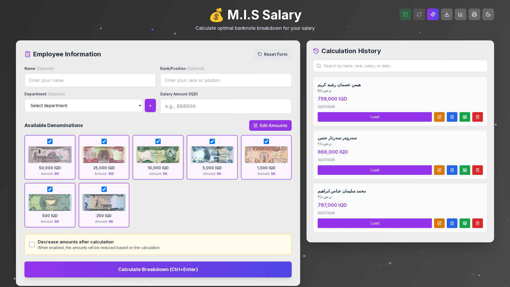
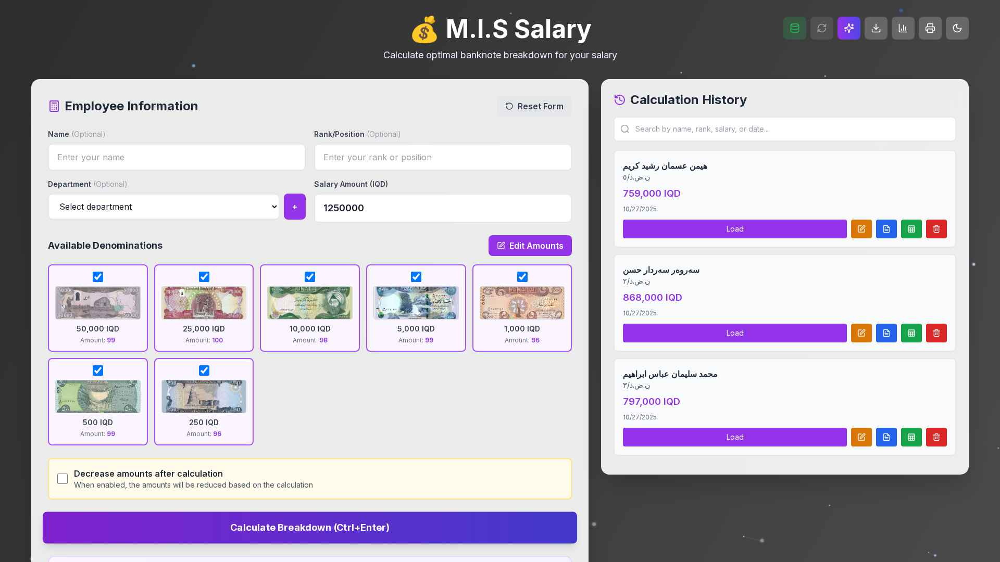
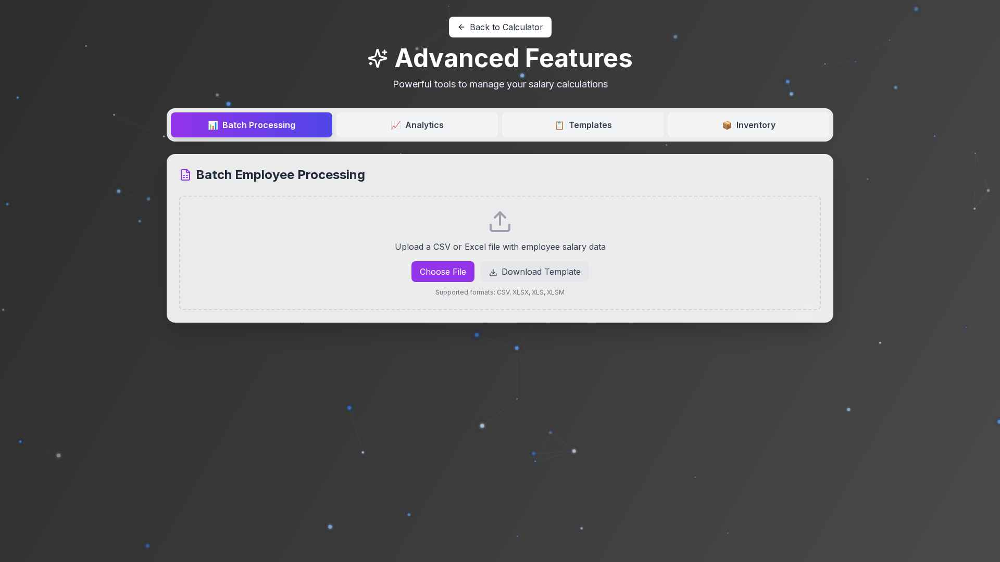
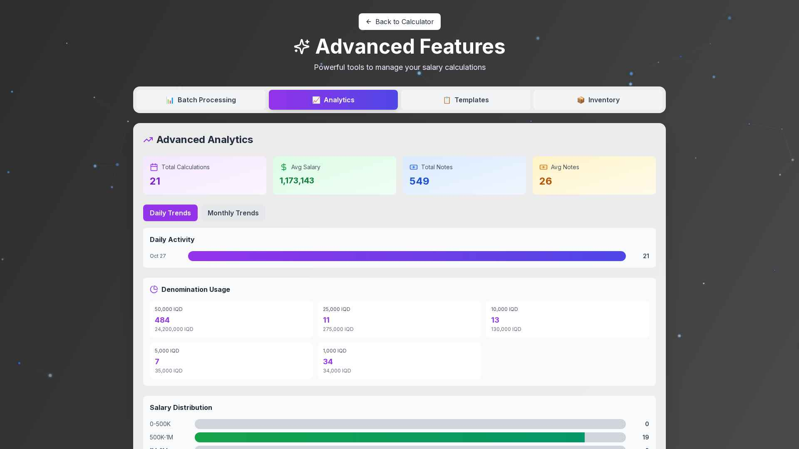
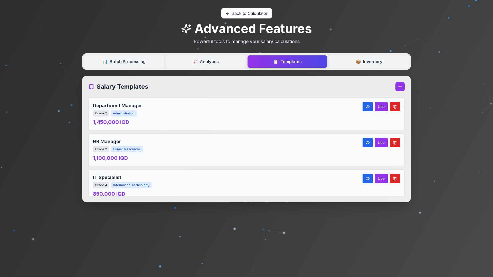
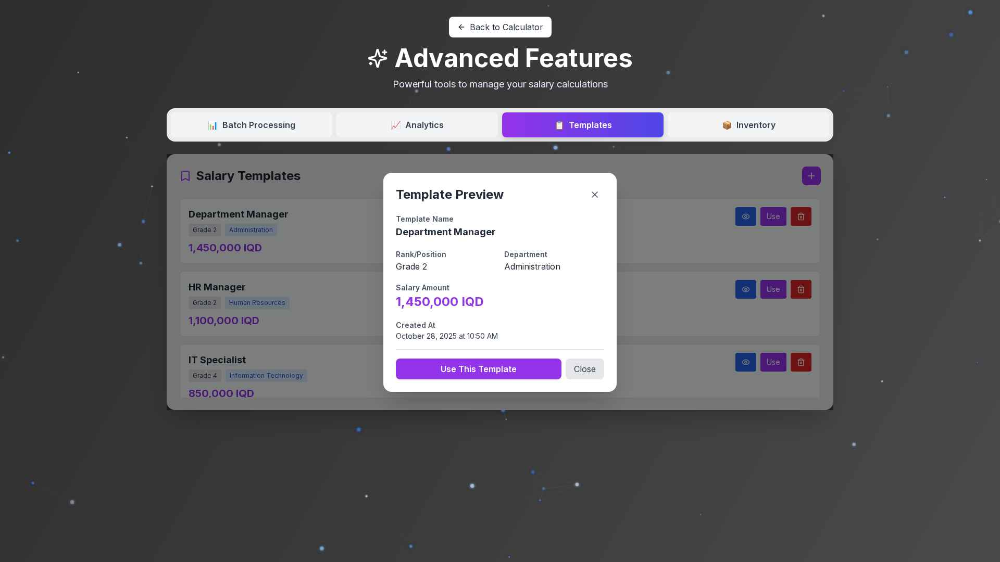
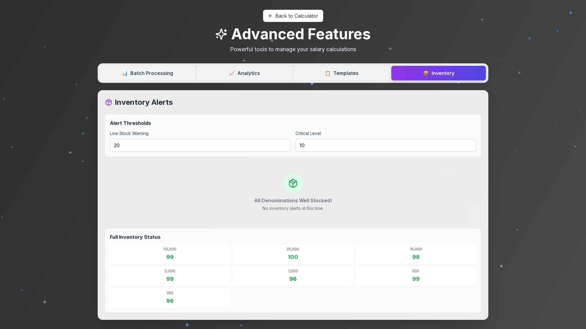

<div align="center">

# 💰 M.I.S Salary Calculator

### Iraqi Dinar Salary Calculator - Professional Banknote Breakdown System

[](https://nextjs.org/)
[](https://www.typescriptlang.org/)
[](https://www.sqlite.org/)
[](LICENSE)

A modern, feature-rich salary calculator application designed to calculate optimal banknote breakdown for salaries in Iraqi Dinar. Built with cutting-edge technologies for maximum performance and user experience.

[Features](#-features) • [Screenshots](#-screenshots) • [Installation](#-installation) • [Usage](#-usage) • [API](#-api-reference) • [Contributing](#-contributing)

</div>

---

## 📋 Table of Contents

- [Features](#-features)
- [Screenshots](#-screenshots)
- [Tech Stack](#-tech-stack)
- [Prerequisites](#-prerequisites)
- [Installation](#-installation)
- [Configuration](#%EF%B8%8F-configuration)
- [Usage](#-usage)
- [Advanced Features](#-advanced-features)
- [Project Structure](#-project-structure)
- [API Reference](#-api-reference)
- [Database Schema](#-database-schema)
- [Keyboard Shortcuts](#%EF%B8%8F-keyboard-shortcuts)
- [Deployment](#-deployment)
- [Troubleshooting](#-troubleshooting)
- [Contributing](#-contributing)
- [License](#-license)
- [Contact](#-contact)

---

## ✨ Features

### Core Functionality
- 💰 **Smart Salary Breakdown** - Automatically calculates optimal banknote combinations for any salary amount
- 🔢 **Multi-Denomination Support** - Works with all Iraqi Dinar denominations (50,000 to 250 IQD)
- 📊 **Real-time Calculation** - Instant results with visual breakdown
- 💾 **History Management** - Save, search, and manage all calculation records
- 🔍 **Fuzzy Search** - Intelligent search through calculation history by name, rank, salary, or date

### Advanced Features
- 📈 **Analytics Dashboard** - Comprehensive statistics and insights on salary calculations
- 📋 **Salary Templates** - Pre-configured templates for common positions (8 examples included)
- 👁️ **Template Preview** - Preview template details before applying
- 📦 **Batch Processing** - Process multiple salary calculations at once (CSV/Excel upload)
- 🏪 **Inventory Management** - Track denomination availability with low-stock alerts

### Database Features
- 🗄️ **Database Status Monitor** - Real-time connection status indicator
- 🔄 **Reconnect Functionality** - Manual database reconnection with one click
- 🔔 **Visual Status Indicators** - Color-coded status (Green=Connected, Red=Disconnected)
- ⚡ **Auto-check** - Automatic status verification every 30 seconds

### Export & Printing
- 📄 **PDF Export** - Generate professional PDF reports for individual or batch calculations
- 📊 **Excel Export** - Export data to Excel spreadsheets with full formatting
- 🖨️ **Print Support** - Direct print functionality with optimized layouts
- 📥 **Bulk Export** - Download entire database as Excel

### User Experience
- 🌙 **Dark Mode** - Eye-friendly dark theme with smooth transitions
- ⌨️ **Keyboard Shortcuts** - Power user features for faster operations
- 📱 **Fully Responsive** - Optimized for desktop, tablet, and mobile devices
- 🎨 **Modern UI** - Beautiful interface with animated background
- 🔄 **Real-time Updates** - Instant feedback and live data synchronization

### Customization
- 💵 **Denomination Management** - Adjust available amounts for each denomination
- 🏢 **Department Management** - Customize and manage department lists
- ⚙️ **Flexible Settings** - Configure calculation preferences and thresholds

---

## 📸 Screenshots

### Main Application

#### Homepage - Salary Calculator

*Main calculation interface with employee information form, denomination selection, and calculation history*

#### Calculation Result

*Real-time calculation results showing optimal banknote breakdown*

#### Database Status Indicator

*Real-time database connection monitoring with reconnect button*

---

### Advanced Features

#### Batch Processing

*Upload CSV/Excel files for bulk salary calculations*

#### Analytics Dashboard

*Comprehensive statistics dashboard showing trends and insights*

#### Salary Templates

*Pre-configured salary templates with preview functionality*

#### Template Preview Modal

*Detailed preview of template information before applying*

#### Inventory Management

*Track denomination stock levels with customizable alerts*

---

## 🛠 Tech Stack

### Frontend
- **Framework:** [Next.js 15](https://nextjs.org/) - React framework with App Router
- **Language:** [TypeScript](https://www.typescriptlang.org/) - Type-safe JavaScript
- **Styling:** [Tailwind CSS](https://tailwindcss.com/) - Utility-first CSS framework
- **UI Components:** [Radix UI](https://www.radix-ui.com/) - Accessible component primitives
- **Icons:** [Lucide React](https://lucide.dev/) - Beautiful icon library
- **Animations:** CSS3 Transitions & Transforms
- **Search:** [Fuse.js](https://fusejs.io/) - Fuzzy search library

### Backend
- **Database:** [SQLite](https://www.sqlite.org/) with [better-sqlite3](https://github.com/WiseLibs/better-sqlite3)
- **API:** Next.js API Routes (REST)
- **PDF Generation:** [PDFKit](https://pdfkit.org/)
- **Excel Generation:** [ExcelJS](https://github.com/exceljs/exceljs)
- **HTTP Client:** [Axios](https://axios-http.com/)

### Additional Tools
- **Date Handling:** [date-fns](https://date-fns.org/)
- **Forms:** [React Hook Form](https://react-hook-form.com/) with Zod validation
- **UUID Generation:** [uuid](https://github.com/uuidjs/uuid)

---

## 📦 Prerequisites

Before you begin, ensure you have the following installed:

- **Node.js** (version 18 or higher)
  ```bash
  node --version  # Should be v18.0.0 or higher
  ```

- **Yarn** (version 1.22 or higher)
  ```bash
  yarn --version  # Should be 1.22.0 or higher
  ```

- **Git** (for cloning the repository)
  ```bash
  git --version
  ```

---

## 🚀 Installation

### Quick Start (Recommended)

```bash
# Clone the repository
git clone https://github.com/bazhdarrzgar/calculate-slalary.git

# Navigate to project directory
cd calculate-slalary

# Install dependencies
yarn install

# Build for production (recommended)
yarn build

# Start production server
yarn start
```

Open [http://localhost:3000](http://localhost:3000) in your browser to see the application.

### Development Mode

```bash
# Install dependencies
yarn install

# Start development server with hot reload
yarn dev
```

### What Gets Installed

The installation includes:
- Next.js 15 and React 19
- TypeScript and type definitions
- Tailwind CSS and PostCSS
- Radix UI components (accordion, dialog, dropdown, etc.)
- Database drivers (better-sqlite3)
- Export libraries (PDFKit, ExcelJS)
- Canvas support for PDF generation
- And more...

### Database Initialization

The database is automatically created on first run with:
- **3 Tables:** calculations, denominations, salary_templates
- **7 Default Denominations:** 50,000, 25,000, 10,000, 5,000, 1,000, 500, 250 IQD
- **8 Example Templates:** Pre-loaded salary templates for common positions

---

## ⚙️ Configuration

### Environment Variables

The application works out-of-the-box with sensible defaults. No environment variables are required.

**Optional Configuration:**

```bash
# Application
NODE_ENV=production  # or development
PORT=3000           # Application port (default: 3000)

# Database (auto-configured)
# SQLite database location: /app/database/currency_calculator.db
```

### Port Configuration

To change the default port, modify `package.json`:

```json
{
  "scripts": {
    "dev": "next dev -p 3001",     // Development port
    "start": "next start -p 3001"  // Production port
  }
}
```

### Customization Options

#### 1. Currency Denominations
- Managed through the UI (click "Edit Amounts" button)
- Changes persist in the database
- Can be reset to defaults

#### 2. Salary Templates
- Add custom templates via the Templates tab
- Edit or delete existing templates
- Preview templates before using

#### 3. Theme Customization

Modify colors in `tailwind.config.ts`:

```typescript
export default {
  theme: {
    extend: {
      colors: {
        primary: '#8b5cf6',    // Purple
        secondary: '#6366f1',  // Indigo
        // Add your custom colors
      }
    }
  }
}
```

---

## 📖 Usage

### Basic Workflow

1. **Enter Employee Information**
   - Name (optional)
   - Rank/Position (optional)
   - Select Department (optional)
   - Input Salary Amount (required)

2. **Select Denominations**
   - Choose which currency denominations to use
   - All denominations are selected by default
   - Click on denomination cards to toggle selection

3. **Calculate**
   - Click "Calculate Breakdown" button
   - Or press `Ctrl+Enter` keyboard shortcut
   - View the optimal banknote distribution instantly

4. **Save & Export**
   - Save calculation to history
   - Export as PDF or Excel
   - Print directly from browser

### Advanced Operations

#### Search & Filter History
```
Search by:
✓ Employee name
✓ Rank/position  
✓ Salary amount
✓ Date of calculation (MM/DD/YYYY format)
```

#### Using Templates
1. Click "Advanced Features" button
2. Go to "Templates" tab
3. Click 👁️ "Preview" to view template details
4. Click "Use" to apply template to calculator

#### Batch Processing
1. Go to Advanced Features → Batch Processing
2. Upload CSV/Excel file with employee data
3. Download template for correct format
4. Process all calculations at once

#### Database Management
- **Green database icon** = Connected
- **Red database icon** = Disconnected  
- **Click reconnect button** (🔄) to manually reconnect
- Status updates automatically every 30 seconds

---

## 🌟 Advanced Features

### Analytics Dashboard

Access via `Advanced Features → Analytics`:
- **Total Calculations** - Track usage
- **Average Salary** - Salary insights
- **Total Notes Used** - Denomination usage
- **Daily Trends** - Activity visualization
- **Denomination Usage** - Most used denominations
- **Salary Distribution** - Salary range analysis

### Salary Templates

8 pre-configured templates included:
1. Department Manager (1,450,000 IQD)
2. HR Manager (1,100,000 IQD)
3. IT Specialist (850,000 IQD)
4. Legal Advisor (1,050,000 IQD)
5. Medical Doctor (1,350,000 IQD)
6. Senior Accountant (980,000 IQD)
7. Senior Engineer (1,250,000 IQD)
8. Teacher - High School (750,000 IQD)

**Features:**
- Preview before use
- Quick apply to calculator
- Add custom templates
- Edit or delete templates

### Inventory Management

Track denomination stock:
- Set **Low Stock Warning** threshold
- Set **Critical Level** threshold
- Visual alerts when stock is low
- Full inventory status overview

---

## 📁 Project Structure

```
calculate-slalary/
├── app/                          # Next.js app directory
│   ├── api/                      # API routes
│   │   ├── analytics/            # Analytics endpoint
│   │   ├── batch-calculate/      # Batch processing
│   │   ├── calculate/            # Salary calculation
│   │   ├── db-status/            # Database status & reconnect
│   │   ├── denominations/        # Denomination management
│   │   ├── export/               # PDF & Excel export
│   │   ├── history/              # Calculation history
│   │   └── templates/            # Salary templates
│   ├── components/               # React components
│   │   ├── AdvancedAnalytics.tsx
│   │   ├── AnimatedBackground.tsx
│   │   ├── BatchProcessor.tsx
│   │   ├── InventoryAlerts.tsx
│   │   └── SalaryTemplates.tsx
│   ├── features/                 # Advanced features page
│   │   └── page.tsx
│   ├── globals.css               # Global styles
│   ├── layout.tsx                # Root layout
│   └── page.tsx                  # Main calculator page
├── database/
│   ├── db.ts                     # Database connection & schema
│   └── currency_calculator.db    # SQLite database file
├── public/
│   └── currency/                 # Currency denomination images
├── screenshots/                  # Application screenshots
├── .gitignore                    # Git ignore rules
├── next.config.ts                # Next.js configuration
├── package.json                  # Dependencies and scripts
├── postcss.config.mjs            # PostCSS configuration
├── tailwind.config.ts            # Tailwind CSS configuration
├── tsconfig.json                 # TypeScript configuration
└── README.md                     # This file
```

---

## 🔌 API Reference

### Database Status

#### Check Connection Status
```http
GET /api/db-status
```

**Response:**
```json
{
  "connected": true,
  "message": "Database connected successfully"
}
```

#### Reconnect Database
```http
POST /api/db-status
```

**Response:**
```json
{
  "connected": true,
  "message": "Database reconnected successfully",
  "tables": ["calculations", "denominations", "salary_templates"]
}
```

### Denominations

#### Get All Denominations
```http
GET /api/denominations
```

**Response:**
```json
[
  {
    "value": 50000,
    "image_name": "50000.jpg",
    "is_available": 1,
    "amount": 99
  }
]
```

#### Update Denomination Amount
```http
PUT /api/denominations/[value]/amount
```

**Request Body:**
```json
{
  "amount": 100
}
```

#### Reset All Amounts
```http
POST /api/denominations/reset-amounts
```

### Calculations

#### Calculate Salary Breakdown
```http
POST /api/calculate
```

**Request Body:**
```json
{
  "name": "John Doe",
  "rank": "Manager",
  "salary": 1250000,
  "available_denominations": [50000, 25000, 10000, 5000, 1000],
  "decrease_amounts": false
}
```

**Response:**
```json
{
  "success": true,
  "breakdown": [
    { "value": 50000, "count": 25, "image_name": "50000.jpg" }
  ],
  "total_notes": 25,
  "remaining": 0,
  "message": "Calculation successful"
}
```

### History

#### Get All History
```http
GET /api/history
```

#### Save Calculation
```http
POST /api/history
```

#### Get Specific Calculation
```http
GET /api/history/[id]
```

#### Update Calculation
```http
PUT /api/history/[id]
```

#### Delete Calculation
```http
DELETE /api/history/[id]
```

### Templates

#### Get All Templates
```http
GET /api/templates
```

#### Create Template
```http
POST /api/templates
```

**Request Body:**
```json
{
  "name": "Senior Manager",
  "rank": "Grade 1",
  "department": "Management",
  "salary": 1500000
}
```

#### Delete Template
```http
DELETE /api/templates?id=[template_id]
```

### Export

#### Export as PDF
```http
GET /api/export/[id]/pdf
```

#### Export as Excel
```http
GET /api/export/[id]/excel
```

### Analytics

#### Get Analytics Data
```http
GET /api/analytics
```

### Batch Processing

#### Batch Calculate
```http
POST /api/batch-calculate
```

**Request:** Multipart form data with CSV/Excel file

---

## 🗄️ Database Schema

### Table: `calculations`

| Column       | Type    | Description                    |
|-------------|---------|--------------------------------|
| id          | TEXT    | Primary key (UUID)             |
| name        | TEXT    | Employee name                  |
| rank        | TEXT    | Employee rank/position         |
| salary      | INTEGER | Salary amount in IQD           |
| breakdown   | TEXT    | JSON string of breakdown       |
| total_notes | INTEGER | Total number of notes          |
| created_at  | TEXT    | ISO timestamp                  |

### Table: `denominations`

| Column       | Type    | Description                    |
|-------------|---------|--------------------------------|
| value       | INTEGER | Primary key (denomination)     |
| image_name  | TEXT    | Image filename                 |
| is_available| INTEGER | Boolean (0 or 1)               |
| amount      | INTEGER | Available quantity             |

### Table: `salary_templates`

| Column       | Type    | Description                    |
|-------------|---------|--------------------------------|
| id          | TEXT    | Primary key (UUID)             |
| name        | TEXT    | Template name                  |
| rank        | TEXT    | Rank/position                  |
| department  | TEXT    | Department name                |
| salary      | INTEGER | Salary amount in IQD           |
| created_at  | TEXT    | ISO timestamp                  |

---

## ⌨️ Keyboard Shortcuts

Boost your productivity with these keyboard shortcuts:

| Shortcut        | Action                      |
|----------------|------------------------------|
| `Ctrl + Enter` | Calculate salary breakdown   |
| `Ctrl + D`     | Toggle dark/light mode       |
| `Ctrl + S`     | Toggle statistics dashboard  |

---

## 🚀 Deployment

### Deployment Options

#### 1. Production Build (Recommended)

```bash
# Install dependencies
yarn install

# Build for production
yarn build

# Start production server
yarn start
```

The production build includes:
- Optimized JavaScript bundles
- Minified CSS
- Image optimization
- Server-side rendering
- Static page generation

#### 2. Docker Deployment

Create `Dockerfile`:

```dockerfile
FROM node:18-alpine

WORKDIR /app

# Install dependencies
COPY package.json yarn.lock ./
RUN yarn install --frozen-lockfile

# Copy application
COPY . .

# Build application
RUN yarn build

EXPOSE 3000

# Start production server
CMD ["yarn", "start"]
```

Build and run:
```bash
docker build -t salary-calculator .
docker run -p 3000:3000 salary-calculator
```

#### 3. Supervisor (Process Management)

Create `/etc/supervisor/conf.d/nextjs.conf`:

```ini
[program:nextjs]
command=yarn start
directory=/app
autostart=true
autorestart=true
environment=NODE_ENV="production",PORT="3000"
stderr_logfile=/var/log/supervisor/nextjs.err.log
stdout_logfile=/var/log/supervisor/nextjs.out.log
stopsignal=TERM
stopwaitsecs=30
stopasgroup=true
killasgroup=true
```

Manage service:
```bash
sudo supervisorctl reread
sudo supervisorctl update
sudo supervisorctl start nextjs
sudo supervisorctl status
```

#### 4. PM2 Deployment

```bash
# Install PM2
npm install -g pm2

# Start application
pm2 start yarn --name "salary-calculator" -- start

# Save and setup auto-restart
pm2 save
pm2 startup
```

#### 5. Vercel Deployment

```bash
# Install Vercel CLI
npm i -g vercel

# Deploy
vercel
```

**Note:** For Vercel, migrate SQLite to a cloud database (PostgreSQL, MongoDB, etc.)

---

## 🔧 Troubleshooting

### Common Issues

#### Database Connection Issues

**Symptoms:**
- Red database icon
- "Database disconnected" message

**Solutions:**
1. Click the reconnect button (🔄)
2. Check database file exists: `ls -l database/currency_calculator.db`
3. Verify file permissions: `chmod 664 database/currency_calculator.db`
4. Check logs for errors

#### Port Already in Use

**Solution:**
```bash
# Find process
lsof -i :3000

# Kill process
kill -9 <PID>

# Or change port
yarn dev -p 3001
```

#### Build Errors

**Solutions:**
1. Clear cache:
   ```bash
   rm -rf node_modules .next
   yarn install
   yarn build
   ```

2. Check Node.js version:
   ```bash
   node --version  # Should be 18+
   ```

#### Slow Performance

**Solutions:**
1. Use production mode:
   ```bash
   yarn build && yarn start
   ```

2. Clear old history records
3. Optimize database
4. Check system resources

### Getting Help

1. Check [GitHub Issues](https://github.com/bazhdarrzgar/calculate-slalary/issues)
2. Create new issue with:
   - Error message
   - Steps to reproduce
   - System information
   - Screenshots

---

## 🤝 Contributing

We welcome contributions! Here's how:

### Ways to Contribute

- 🐛 Report bugs
- ✨ Suggest features
- 📖 Improve documentation
- 💻 Submit pull requests

### Development Process

1. Fork the repository
2. Create a feature branch: `git checkout -b feature/amazing-feature`
3. Make changes and test thoroughly
4. Commit: `git commit -m "feat: add amazing feature"`
5. Push: `git push origin feature/amazing-feature`
6. Open a Pull Request

### Commit Convention

Follow [Conventional Commits](https://www.conventionalcommits.org/):
- `feat:` - New feature
- `fix:` - Bug fix
- `docs:` - Documentation
- `style:` - Code style
- `refactor:` - Code refactoring
- `test:` - Tests
- `chore:` - Build/tools

---

## 📄 License

This project is licensed under the **MIT License**.

```
MIT License

Copyright (c) 2025 Bazhdar Rzgar

Permission is hereby granted, free of charge, to any person obtaining a copy
of this software and associated documentation files (the "Software"), to deal
in the Software without restriction, including without limitation the rights
to use, copy, modify, merge, publish, distribute, sublicense, and/or sell
copies of the Software, and to permit persons to whom the Software is
furnished to do so, subject to the following conditions:

The above copyright notice and this permission notice shall be included in all
copies or substantial portions of the Software.
```

---

## 📞 Contact

**Project Maintainer:** Bazhdar Rzgar

- **GitHub:** [@bazhdarrzgar](https://github.com/bazhdarrzgar)
- **Repository:** [calculate-slalary](https://github.com/bazhdarrzgar/calculate-slalary)
- **Issues:** [Report a bug](https://github.com/bazhdarrzgar/calculate-slalary/issues)

---

## 🙏 Acknowledgments

### Built With
- [Next.js](https://nextjs.org/) - The React Framework
- [TypeScript](https://www.typescriptlang.org/) - Typed JavaScript
- [Tailwind CSS](https://tailwindcss.com/) - CSS Framework
- [Radix UI](https://www.radix-ui.com/) - UI Components
- [Lucide Icons](https://lucide.dev/) - Icons

### Special Thanks
- Iraqi Dinar currency data
- Open source community
- All contributors and users

---

## 📊 Project Stats


---

<div align="center">

### ⭐ Star this repository if you find it helpful!

**Made with ❤️ by [Bazhdar Rzgar](https://github.com/bazhdarrzgar)**

[⬆ Back to Top](#-mis-salary-calculator)

</div>
